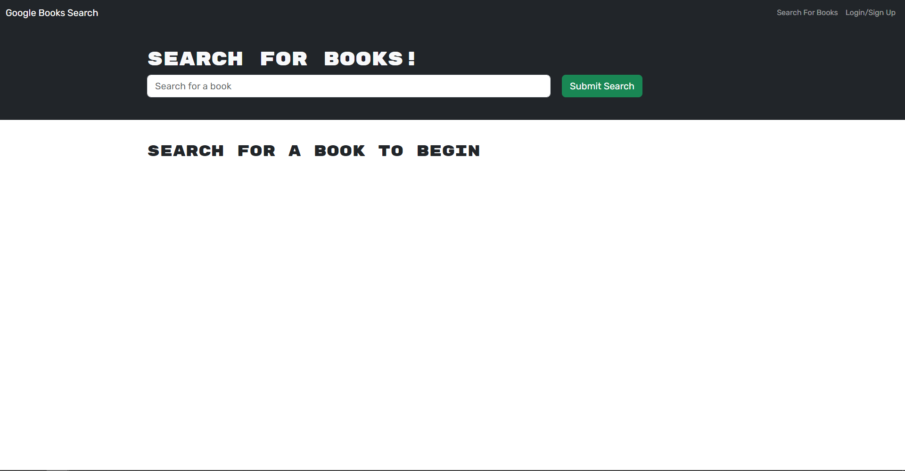
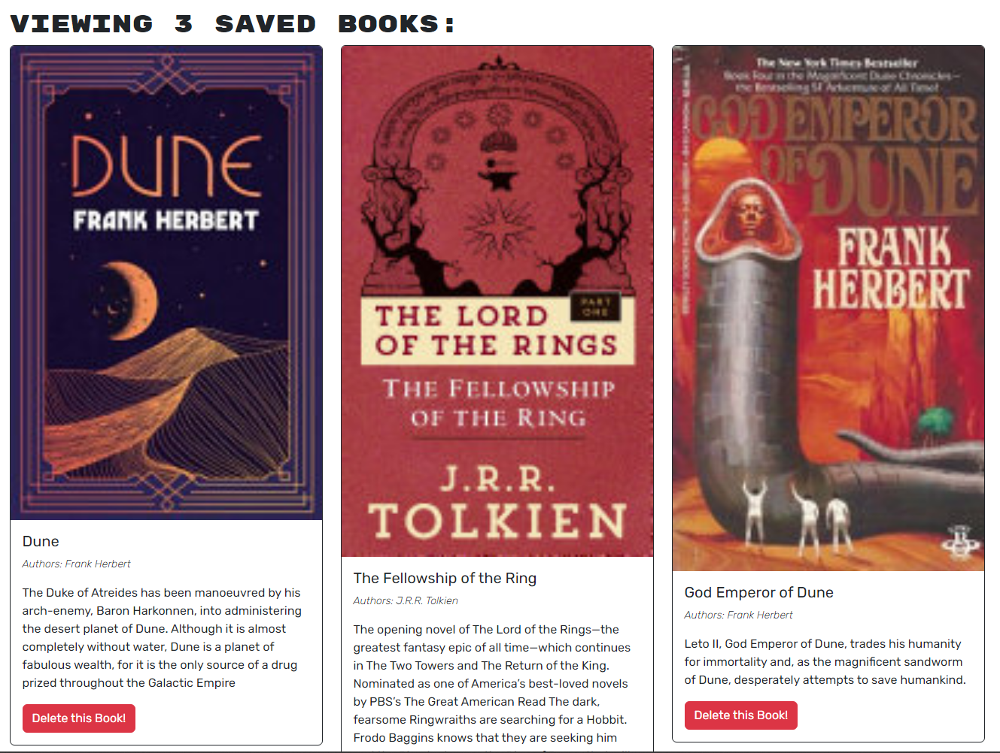

# Book-Search-Engine

## Purpose of Task

Take a fully functioning Google Books API search engine built with a RESTful API, and refactor it to be a GraphQL API built with Apollo Server. The original application was built using the MERN stack, with a React front end, MongoDB database, and Node.js/Express.js server and API.

## Table of Contents

- [Description](#description)

- [Link](#link)

- [Usage](#usage)

- [Screenshots](#screenshots)

## Description

This is a full stack application that allows users to search for books using the Google Books API. Users can create an account, login, and save books to their account. Users can also delete books from their account.

When the user first visits the site they will see a search bar, once the user begins typing in the search bar they will start to get results back for books containing what they've typed so far. The user will be able to see the book's title, authors, description, and an image of the book (if there is an image available).

The user can click on the **Login/Sign Up** button in the navbar to either login to their account or sign up for a new account. Once the user is logged in they will be able to save books to their account by clicking the **Save This Book!** button on the book's card.

The user can view their saved books by navigating to the **See Your Books** using the button in the navbar. The user can delete books from their saved books by clicking the **Delete This Book!** button on the book's card.

## Link

The deployed site is available [here](https://hidden-temple-10144-e7a0c7b1de50.herokuapp.com/)

## Usage

To run this application locally, first clone the repository and open it in your code editor. Open a new terminal and type the following command to install the required dependencies.

```sh
npm i
```

The best way to run this application while developing is to use the following command in the terminal.

```sh
npm run develop
```

This will run both the server and the client side of the application at the same time using the concurrently package, which saves you from having to open two terminals and run the server and client separately. The server will run on port 3001 and the client will run on port 3000. If you make any changes to the code, the server will automatically restart and/or the client will automatically refresh, depending on what code has been changed.

To run only the server side of the application, use the following command in the terminal.

```sh
npm start
```

You can then either use a tool like Insomnia or Postman to test the API routes, or you can navigate to http://localhost:3001/graphql to use the GraphQL playground. The GraphQL playground allows you to easily build queries and mutations and test them out.

## Screenshots





